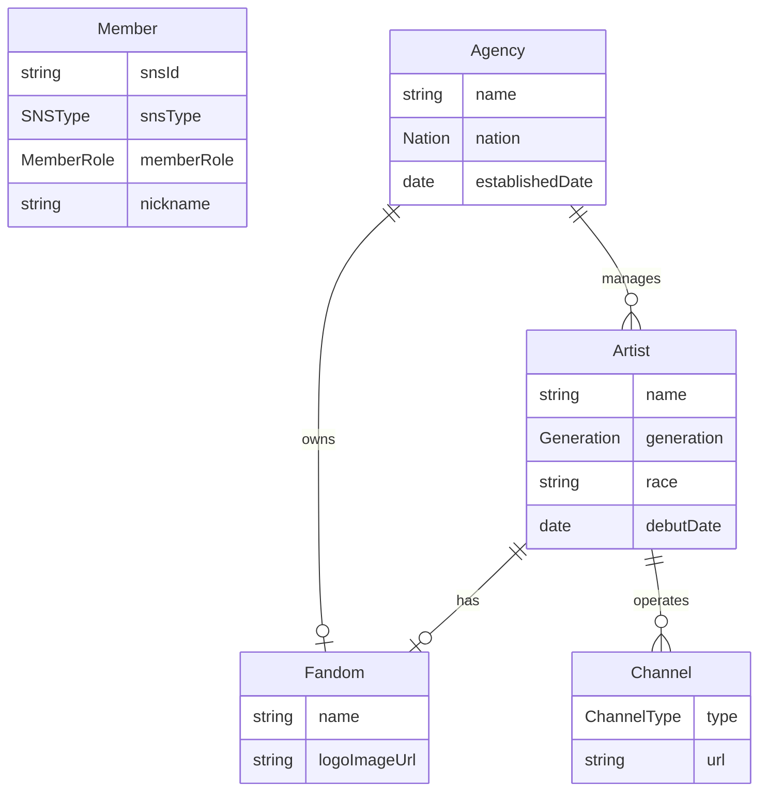

# **Isekai 프로젝트 구조 상세 분석** 🏗️

## 📋 **프로젝트 개요**
**Isekai**는 **아티스트/VTuber 관리 플랫폼**으로, Kotlin + Spring Boot 기반의 엔터프라이즈급 백엔드 시스템입니다.

---

## 🔄 **프로젝트 진화 과정 (Git History 분석)**

### **1단계: 초기 구축 (2025년 2월)**
- 멀티 모듈 구조로 시작 (91개 커밋 누적)
- Spring Security + JWT 기반 인증 시스템 구현
- PostgreSQL + Flyway 데이터베이스 설계

### **2단계: 구조 단순화 (중간)**
- **핵심 변화**: 멀티 모듈 → **단일 모듈**로 구조 변경
- 패키지 경로 재구성: `common`, `domain` 패키지 분리
- DTO 리팩토링 및 불필요 코드 제거

### **3단계: 도메인 정제 (최근)**
- **VTuber** → **Artist**로 도메인 용어 변경 (브랜딩 일반화)
- 카카오 OAuth 회원가입/로그인 플로우 정상화
- MemberRole 필드 추가 (역할 기반 권한 강화)
- Local 환경 설정 분리

---

## 🏛️ **현재 아키텍처 구조**

### **계층형 + 헥사고날 하이브리드 패턴**
```
┌─ Controller ──┐    HTTP 요청/응답 처리
│               │
├─ Facade ──────┤    비즈니스 로직 오케스트레이션
│               │
├─ Service ─────┤    도메인 비즈니스 로직 (Command/Query 분리)
│               │
├─ Repository ──┤    데이터 액세스 (JPA + QueryDSL)
│               │
└─ Entity ──────┘    도메인 모델
```

### **핵심 디자인 패턴**
1. **Facade Pattern**: 여러 Service를 조합하여 복잡한 비즈니스 플로우 처리
2. **CQRS-like**: Command/Query Service 분리
3. **Port/Adapter**: AuthPort를 통한 외부 시스템 연동

---

## 🎯 **도메인 모델 관계도**



### **엔티티별 역할**
- **Member**: 사용자 계정 (카카오 OAuth, 역할 기반)
- **Agency**: 소속사 (아티스트 관리, 팬덤 운영)
- **Artist**: 아티스트/VTuber (소속사 소속, 개별 팬덤 보유)
- **Fandom**: 팬클럽 (소속사 또는 아티스트 단위)
- **Channel**: SNS/플랫폼 채널 (YouTube, Twitch 등)

---

## 🛡️ **보안 아키텍처**

### **인증 플로우**
```
카카오 OAuth → JWT Access Token (30분) + Refresh Token (7일)
                      ↓
HTTP-Only Cookie (CSRF 방지) + Bearer Token (API 인증)
```

### **권한 체계**
- **MemberRole**: NORMAL, ARTIST, CEO, ILLUSTRATOR, DEVELOPER, ADMIN
- **Spring Security**: 경로별 접근 제어
- **Jasypt**: 민감정보 암호화 (DB 연결 정보 등)

---

## 📊 **데이터베이스 설계**

### **Flyway 마이그레이션 전략**
- **Profile별 분리**: `local/`, `dev/` 환경별 스크립트
- **버전 관리**: `V{timestamp}__{description}.sql` 형식
- **점진적 스키마 진화**: VTuber → Artist 테이블명 변경 이력

### **JPA 설계 특징**
- **BaseTimeEntity**: 생성/수정 시간 자동 관리
- **Lazy Loading**: 성능 최적화를 위한 지연 로딩
- **Cascade 전략**: 연관 엔티티 생명주기 관리

---

## 🔧 **기술적 특징**

### **개발 환경**
- **Kotlin 1.9.25** + **Spring Boot 3.4.1**
- **PostgreSQL** + **QueryDSL** (복잡한 쿼리 타입 안전성)
- **KtLint** (코드 품질 관리)
- **P6Spy** (SQL 로깅 및 성능 모니터링)

### **배포 & 운영**
- **Profile 기반 설정**: local, dev 환경 분리
- **Actuator**: 애플리케이션 상태 모니터링
- **Docker 지원**: bootBuildImage 태스크

---

## 🚧 **현재 상태 및 특징**

### **완성된 영역**
✅ 사용자 인증/인가 시스템  
✅ 카카오 소셜 로그인  
✅ 기본 CRUD API 구조  
✅ 데이터베이스 스키마 설계  

### **개발 진행 중**
🔄 ArtistFacade 비즈니스 로직 (getArtistById 미완성)  
🔄 테스트 코드 (구조만 설정, 실제 테스트 없음)  
🔄 API 문서화

### **아키텍처 강점**
- **확장성**: Facade 패턴으로 복잡한 비즈니스 로직 수용 가능
- **유지보수성**: 계층 분리 및 패키지 구조화
- **보안성**: 다층 보안 체계 (OAuth + JWT + 암호화)
- **타입 안전성**: Kotlin + QueryDSL 조합

---

## 📈 **프로젝트의 특수성**

이 프로젝트는 **VTuber/아티스트 관리**라는 특화된 도메인을 다루면서도, **일반적인 엔터테인먼트 관리 플랫폼**으로 확장 가능한 유연한 구조를 갖추고 있습니다. Git 히스토리에서 보이는 지속적인 리팩토링은 **코드 품질과 구조 개선**에 대한 개발자의 높은 의식을 보여줍니다.